# socialcalc-ai

[](https://www.npmjs.com/package/socialcalc-ai)
[](https://opensource.org/licenses/MIT)
[](https://www.typescriptlang.org/)
[](https://nodejs.org/api/esm.html)

> **A modernized, modularized, high-performance spreadsheet engine with ES6 module exports, React/Ionic UI components, AI template capabilities, and an extensible plugin system.**

Derived from Dan Bricklin's proven, industrial-strength **SocialCalc** engine, `socialcalc-ai` has been re-architected for modern web, mobile, and AI-driven applications. It replaces legacy global variables with clean ES modules, provides full TypeScript definitions, adds smooth mobile touch physics, and includes a full suite of modern React/Ionic UI controls.

---

## 📑 Table of Contents

- [Features](#-features)
- [Installation](#-installation)
- [Quick Start in React / Ionic](#-quick-start-in-react--ionic)
- [Quick Start in Vanilla JavaScript](#-quick-start-in-vanilla-javascript)
- [Architecture Overview](#-architecture-overview)
  - [Core Engine Reference (`core/README.md`)](core/README.md)
- [UI Components](#-ui-components)
  - [CellEditModal](#1-celleditmodal)
  - [HorizontalScrollBar](#2-horizontalscrollbar)
  - [RowActionPopover](#3-rowactionpopover)
  - [EditableCellsModal](#4-editablecellsmodal)
  - [DemoVideosModal](#5-demovideosmodal)
  - [AgentModal](#6-agentmodal)
- [Plugins & Modules API](#-plugins--modules-api)
  - [Row & Column Headers](#1-row--column-headers-modulesrow-col-headersjs)
  - [Grid Lines](#2-grid-lines-modulesgrid-linesjs)
  - [Smooth Touch Scroll](#3-smooth-touch-scroll-modulestouch-scrolljs)
  - [Horizontal Scroll](#4-horizontal-scroll-moduleshorizontal-scrolljs)
  - [Editable Cells & Template Locks](#5-editable-cells--template-locks-moduleseditable-cellsjs)
  - [Plugin Manager](#6-plugin-manager-modulesplugin-managerjs)
  - [History & Undo/Redo](#7-history-undo--redo-moduleshistoryjs)
  - [Exporters & Sheets](#8-exporters--sheets-modulesexportersjs-modulessheetsjs)
  - [Invoice Utilities](#9-invoice-utilities-modulesinvoicejs)
  - [AI Agent Plugin (Text Editor Agent)](#10-ai-agent-plugin-text-editor-agent-modulesagentjs)
  - [Cell Formatting & Display Suite](#11-cell-formatting--display-suite)
  - [Offline PDF Export Plugin](#12-offline-pdf-export-plugin-socialcalc-aipdf-export)
  - [Share, Email & Print Plugin](#13-share-email--print-plugin-socialcalc-aishare)
- [Event-Driven Architecture](#-event-driven-architecture)
- [AI & MultiSheet Calc (MSC) Integration](#-ai--multisheet-calc-msc-integration)
- [TypeScript Support](#-typescript-support)
- [Browser & Framework Compatibility](#-browser--framework-compatibility)
- [License & Acknowledgments](#-license--acknowledgments)

---

## ✨ Features

- **⚡ Modern ES6 Architecture**: Pure ES module exports replacing legacy global namespace pollution. Works with Vite, Next.js, Webpack, Rollup, and ES2020+ runtimes.
- **📱 Touch & Mobile Optimized**: Smooth momentum physics and inertia swipe scrolling without screen jumping or layout stutter.
- **🎨 Modern React & Ionic UI Suite**:
  - Full-featured **CellEditModal** (Formulas, rich formatting, custom color palettes, borders, and compressed image inserts).
  - Smooth **HorizontalScrollBar** with live column indicators and drag navigation.
  - Interactive **RowActionPopover** for dynamic row insertion and deletion.
  - **EditableCellsModal** to inspect and manage cell locks.
  - **DemoVideosModal** with an interactive formula cheat sheet.
- **🔌 Pluggable Architecture**: Dynamically enable, disable, or configure spreadsheet subsystems (headers, gridlines, momentum scroll, locks).
- **📐 Universal Calculation Engine**: Industrial-grade formula AST evaluator supporting standard math, statistics, string, logic, and financial functions.
- **🤖 AI-Ready MultiSheet Calc (MSC)**: Serialize and deserialize full spreadsheet workbooks as structured JSON or MSC strings, ideal for LLM spreadsheet generation pipelines.
- **🛡 Full TypeScript Definitions**: First-class `index.d.ts` definitions included out of the box.

---

## 📦 Installation

Install `socialcalc-ai` via npm:

```bash
npm install socialcalc-ai
```

Or using Yarn / pnpm:

```bash
# Using Yarn
yarn add socialcalc-ai

# Using pnpm
pnpm add socialcalc-ai
```

### Peer Dependencies

If you plan to use the pre-built React / Ionic components (`CellEditModal`, `HorizontalScrollBar`, etc.), ensure the peer dependencies are installed:

```bash
npm install react react-dom @ionic/react ionicons
```

*(Note: Peer dependencies are optional if you only consume the core calculation engine in headless Node.js or Vanilla JS environments).*

---

## 🚀 Quick Start in React / Ionic

Below is a complete, minimal working example showing how to mount the spreadsheet engine and hook up the interactive React UI suite:

```tsx
import React, { useEffect, useState } from "react";
import * as AppGeneral from "socialcalc-ai";
import {
  CellEditModal,
  HorizontalScrollBar,
  RowActionPopover,
  EditableCellsModal,
} from "socialcalc-ai";

// Optional: Ionic base styles if using Ionic framework
import "@ionic/react/css/core.css";

export const SpreadsheetEditor: React.FC = () => {
  const [cellEditData, setCellEditData] = useState<any>(null);
  const [showEditModal, setShowEditModal] = useState(false);
  const [rowPopoverEvent, setRowPopoverEvent] = useState<{ event: any; rowNum: number } | null>(null);

  useEffect(() => {
    // 1. Initialize SocialCalc DOM container with initial data (or empty string)
    const initialMSC = ""; 
    AppGeneral.initializeApp(initialMSC);

    // 2. Activate desired plugins
    AppGeneral.enableRowColHeaders(); // 1, 2, 3... & A, B, C... headers with resize handles
    AppGeneral.enableGridLines();      // Modern cell border grid
    AppGeneral.enableTouchScroll();    // Smooth mobile inertia scroll

    // 3. Listen for Cell Edit Modal requests
    const handleCellEdit = (e: any) => {
      setCellEditData(e.detail);
      setShowEditModal(true);
    };

    // 4. Listen for Row Header clicks (context actions)
    const handleRowClick = (e: any) => {
      setRowPopoverEvent({
        event: e.detail.originalEvent || e.detail,
        rowNum: e.detail.rowNum,
      });
    };

    window.addEventListener("socialcalc:cell-edit-request", handleCellEdit);
    window.addEventListener("socialcalc:row-header-click", handleRowClick);

    return () => {
      window.removeEventListener("socialcalc:cell-edit-request", handleCellEdit);
      window.removeEventListener("socialcalc:row-header-click", handleRowClick);
    };
  }, []);

  return (
    <div style={{ position: "relative", width: "100%", height: "100vh", overflow: "hidden" }}>
      {/* SocialCalc DOM Mounting Target Elements */}
      <div id="container" style={{ width: "100%", height: "calc(100% - 44px)" }}>
        <div id="workbookControl" style={{ display: "none" }}></div>
        <div id="tableeditor" style={{ width: "100%", height: "100%" }}></div>
        <div id="msg"></div>
      </div>

      {/* Horizontal Viewport Scrollbar */}
      <HorizontalScrollBar />

      {/* Rich Cell Editor Bottom Sheet */}
      <CellEditModal
        isOpen={showEditModal}
        cellData={cellEditData}
        onClose={() => setShowEditModal(false)}
      />

      {/* Row Insert / Delete Popover */}
      <RowActionPopover
        isOpen={!!rowPopoverEvent}
        event={rowPopoverEvent?.event}
        selectedRow={rowPopoverEvent?.rowNum}
        onDismiss={() => setRowPopoverEvent(null)}
      />
    </div>
  );
};

export default SpreadsheetEditor;
```

---

## 🌐 Quick Start in Vanilla JavaScript

`socialcalc-ai` can be used in plain HTML/JavaScript or non-React web apps without any framework overhead:

```html
<!DOCTYPE html>
<html lang="en">
<head>
  <meta charset="UTF-8" />
  <title>SocialCalc AI Standalone</title>
</head>
<body>
  <div id="container">
    <div id="workbookControl" style="display: none;"></div>
    <div id="tableeditor"></div>
    <div id="msg"></div>
  </div>

  <script type="module">
    import * as SocialCalcApp from "socialcalc-ai";

    // Initialize spreadsheet
    SocialCalcApp.initializeApp("");

    // Enable modern features
    SocialCalcApp.enableGridLines();
    SocialCalcApp.enableRowColHeaders();
    SocialCalcApp.enableTouchScroll();

    // Listen for cell change events
    SocialCalcApp.setupCellChangeListener((coord, value) => {
      console.log(`Cell ${coord} updated:`, value);
    });
  </script>
</body>
</html>
```

---

## 📁 Architecture Overview

```text
socialcalc-ai/
├── index.js                      # Main entry point: aggregates core, modules & UI
├── index.d.ts                    # Complete TypeScript typings
├── package.json                  # Standalone package definition
├── core/                         # Spreadsheet engine - full reference in core/README.md
│   ├── index.js                  # Imports the modules below in load order; exports the SocialCalc singleton
│   ├── constants.js              # UI strings (localization), default styles & sizes
│   ├── sheet.js                  # Cell & Sheet model, save format, command language, recalc, undo, clipboard
│   ├── render.js                 # RenderContext (HTML table), coordinate/DOM helpers, value display, CSV/HTML conversion
│   ├── touch.js                  # Touch detection & gesture handling
│   ├── format-number.js          # Excel-style number and date format strings
│   ├── formula.js                # Formula tokenizer, parser, evaluator & function registry
│   ├── formula-functions.js      # 109 built-in functions (stat, math, text, date, lookup, financial)
│   ├── popup.js                  # Popup list & color chooser widgets
│   ├── table-editor.js           # Interactive grid: cursor, selection, scrolling, input box, cell actions
│   ├── editor-widgets.js         # Cell handles, scrollbars, drag/tooltip/button/wheel registries, keyboard
│   ├── spreadsheet-control.js    # Spreadsheet UI: toolbar tabs, formula bar, settings, save/load
│   ├── workbook.js               # Multi-sheet WorkBook & WorkBookControl, sheet bar, MSC save/load
│   └── environment.js            # Loaded last: JSON polyfill, app overrides, server/worker shims
├── modules/                      # Modular functional features & plugins
│   ├── plugin-manager.js         # Central registry for dynamic SocialCalc plugins
│   ├── grid-lines.js             # Cell border grid-lines plugin
│   ├── row-col-headers.js        # 123 / ABCD headers with resize handles & row selection
│   ├── touch-scroll.js           # Momentum/inertia mobile touch scroll
│   ├── horizontal-scroll.js      # Viewport tracking & horizontal scrolling subscriptions
│   ├── editable-cells.js         # Cell lock & template permission plugin
│   ├── listeners.js              # Mouse, click, and custom event dispatches
│   ├── formatting.js             # Cell formatting, font colors, background colors, borders
│   ├── sheets.js                 # Multi-sheet management, switching, renaming
│   ├── history.js                # Undo / Redo command history stacks
│   ├── init.js                   # Workbook & table editor DOM initialization
│   ├── prompts.js                # Enhanced input dialogs & modal dispatchers
│   ├── exporters.js              # HTML, CSV, MSC export helpers
│   ├── invoice.js                # Coordinate mapping & invoice utilities
│   ├── device.js                 # Device detection and responsive helpers
│   ├── logos.js                  # Brand/logo helper utilities
│   ├── utils.js                  # Coordinate conversions, DOM utilities
│   └── weight.js                 # Cell weight/scoring utilities
├── components/                   # React & Ionic UI Components
│   ├── CellEditModal/            # Rich editor sheet (Formulas, Text, Colors, Borders, Images)
│   ├── HorizontalScrollBar.tsx   # Smooth horizontal navigation bar & track slider
│   ├── RowActionPopover/         # Context menu for row insertion & deletion
│   ├── EditableCellsModal/       # Template mapping manager & cell lock editor
│   └── DemoVideosModal/          # Formula cheat sheet and interactive tutorials
└── utils/
    ├── imageCompressor.ts        # Client-side image compression for cell image inserts
    └── scriptLoader.ts           # Dynamic script loader utility
```

---

## 🎨 UI Components

### 1. `CellEditModal`
A modern, responsive bottom-sheet modal that replaces legacy browser `prompt()` dialogs with a rich spreadsheet formatting bar:
- **Formula & Text Editor**: Live input bar with syntax validation (e.g. `=SUM(A1:B10)`).
- **Styling**: Bold, Italic, Alignment (Left, Center, Right).
- **Curated Palette**: 8 font colors (`FONT_COLORS`) and 7 background colors (`BG_COLORS`).
- **Cell Borders**: Top, Bottom, Left, Right, and All borders with Solid, Dashed, or Dotted styles.
- **Image Insertion**: Embed images into cells with automatic client-side compression via `imageCompressor.ts`.
- **Fallback**: Automatically falls back to native inline input if modal mode is disabled.

<p align="center">
  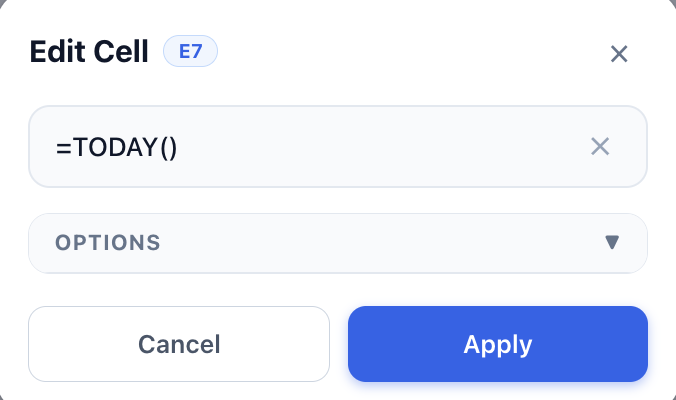
  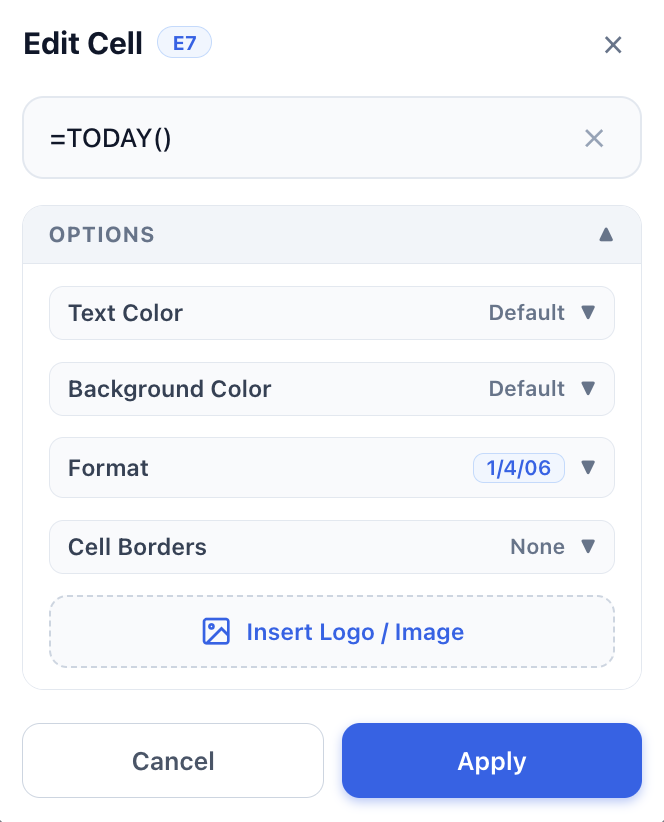
</p>
<p align="center">
  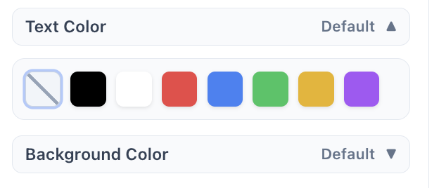
  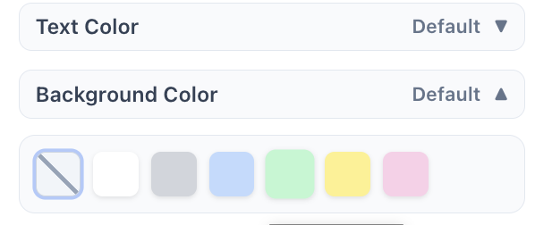
  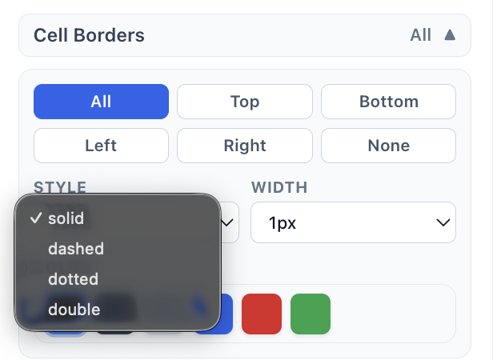
</p>

```tsx
<CellEditModal
  isOpen={isOpen}
  cellData={cellData}
  onClose={() => setIsOpen(false)}
/>
```

### 2. `HorizontalScrollBar`
A smooth horizontal track controller designed specifically for wide spreadsheets on mobile and desktop:
- Step-by-step column advancement buttons (◀ / ▶).
- Responsive drag track with active column indicator (e.g., `Cols: A - J`).
- Synchronizes bi-directionally with keyboard arrow navigation and touch scrolling.

```tsx
<HorizontalScrollBar />
```

### 3. `RowActionPopover`
A context popup that appears when clicking any row header index:
- **Insert Row Above**: Inserts an empty row above the selected index.
- **Insert Row Below**: Inserts an empty row below the selected index.
- **Delete Row**: Removes the selected row and cascades formula references.

<p align="center">
  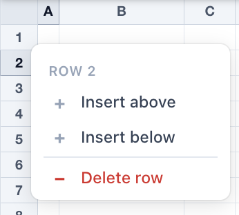
</p>

```tsx
<RowActionPopover
  isOpen={showPopover}
  event={clickEvent}
  selectedRow={rowNumber}
  onDismiss={() => setShowPopover(false)}
/>
```

### 4. `EditableCellsModal`
An administrative inspector for template creators:
- View all locked vs editable cells in the active sheet.
- Bind application field mappings (e.g., `vendor_name -> B4`) to spreadsheet coordinates.
- Test template locking permissions.

<p align="center">
  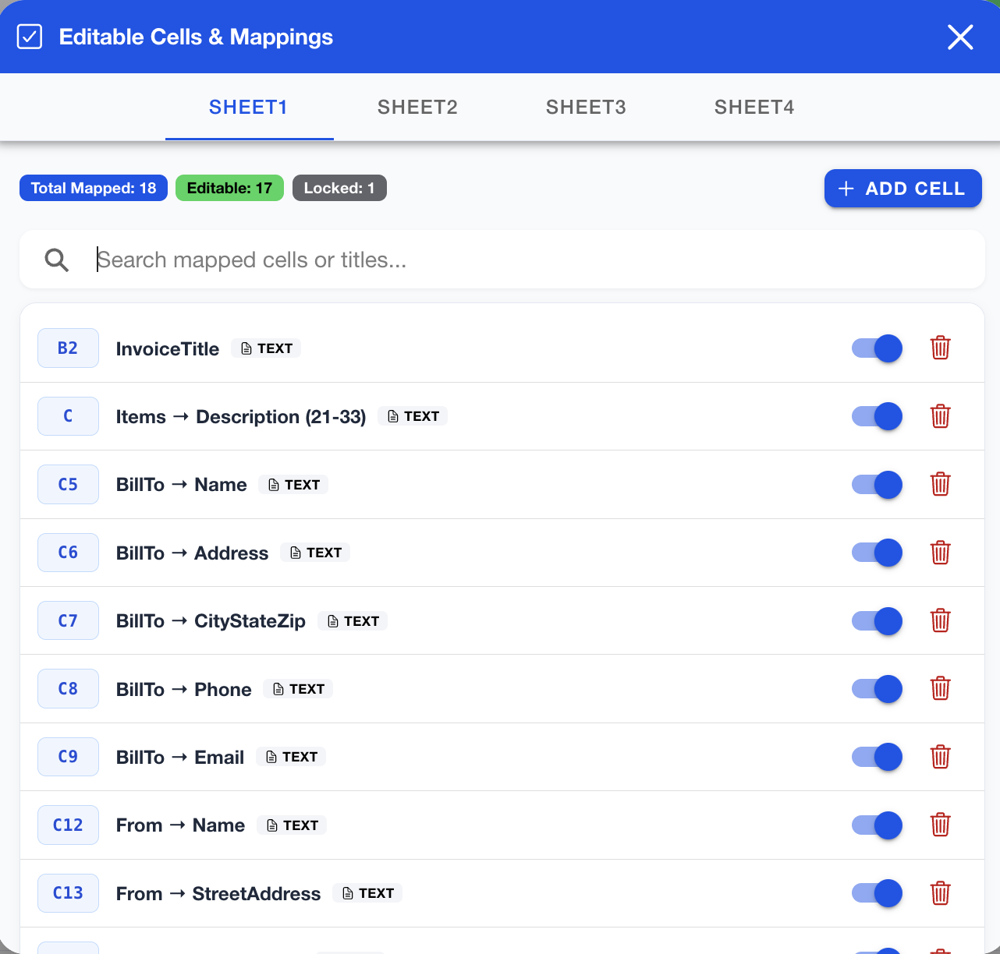
</p>

```tsx
<EditableCellsModal
  isOpen={showModal}
  onClose={() => setShowModal(false)}
/>
```

### 5. `DemoVideosModal`
An interactive help and reference modal containing:
- Built-in formula cheat sheets (`SUM`, `AVERAGE`, `IF`, `VLOOKUP`, `COUNT`, `CONCATENATE`, etc.).
- Embedded tutorial guides for spreadsheet operators.

```tsx
<DemoVideosModal
  isOpen={showHelp}
  onClose={() => setShowHelp(false)}
/>
```

### 6. `AgentModal`
An interactive AI Agent Workbench and chat modal:
- Inspect active sheet context, dimensions, and detected `appMapping` fields.
- Test one-click quick actions (e.g. fill invoice header, populate table items, set formula).
- Execute custom JSON action arrays directly or copy LLM tool schemas (Gemini function declarations, OpenAI tools, and system prompts).
- View real-time action execution logs.

<p align="center">
  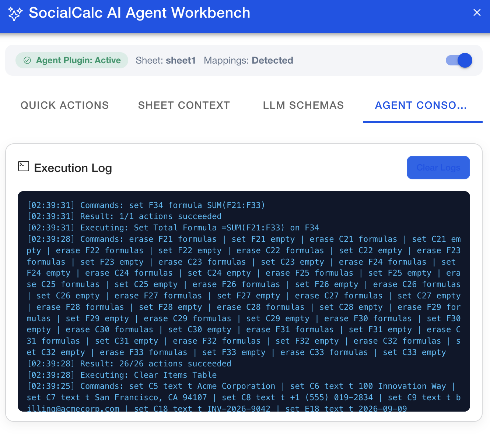
</p>

```tsx
<AgentModal
  isOpen={showAgentModal}
  onClose={() => setShowAgentModal(false)}
  appMapping={appMapping}
  currentSheet="sheet1"
  onExecute={(res) => console.log("Agent actions:", res)}
/>
```

#### Customizable Tab Combinations & Header Controls:
Developers can customize which tabs are visible, choose specific combinations, and optionally hide the tab headers bar:

```tsx
// Example 1: Show only AI Copilot and Sheet Context
<AgentModal
  isOpen={showAgentModal}
  onClose={() => setShowAgentModal(false)}
  enabledTabs={["actions", "context"]}
/>

// Example 2: Minimalist AI Copilot with NO tab headers bar (pure chatbot view)
<AgentModal
  isOpen={showAgentModal}
  onClose={() => setShowAgentModal(false)}
  enabledTabs={["actions"]}
  hideTabHeaders={true}
/>

// Example 4: Built-in Generic Spreadsheet Suggestions
<AgentModal
  isOpen={showAgentModal}
  onClose={() => setShowAgentModal(false)}
  suggestions="generic"
  suggestionsTitle="Helpful Prompts:"
/>

// Example 5: Custom Developer Prompt Suggestions
<AgentModal
  isOpen={showAgentModal}
  onClose={() => setShowAgentModal(false)}
  suggestionsTitle="Payroll Shortcuts:"
  suggestions={[
    { label: "Calculate Overtime", prompt: "Compute overtime pay at 1.5x for hours over 40." },
    { label: "Format Currency", prompt: "Format all salary and total cells to USD currency." },
    { label: "Summarize Depts", prompt: "Group departments and show total expenditure per department." },
  ]}
  promptPlaceholder="Ask AI to analyze payroll or edit cells..."
/>

// Example 6: Custom Header Title, Icon, and Color/Gradient
<AgentModal
  isOpen={showAgentModal}
  onClose={() => setShowAgentModal(false)}
  title="Financial Copilot"
  headerIcon={calculatorOutline}
  headerIconColor="#38bdf8"
  headerColor="linear-gradient(135deg, #0284c7 0%, #0369a1 100%)"
  headerTextColor="#ffffff"
  versionTag="Finance v1.0"
// Example 7: Overall Modal Visual Themes
<AgentModal
  isOpen={showAgentModal}
  onClose={() => setShowAgentModal(false)}
  theme="dark" // or "midnight" | "emerald" | "purple" | "slate" | "light" | "default"
/>

// Example 8: Custom Theme Configuration Object
<AgentModal
  isOpen={showAgentModal}
  onClose={() => setShowAgentModal(false)}
  theme={{
    mode: "dark",
    primaryColor: "#059669",
    headerBackground: "linear-gradient(135deg, #064e3b, #047857)",
    cardBackground: "#111827",
  }}
/>
```

| Prop | Type | Default | Description |
|------|------|---------|-------------|
| `theme` | `"default" \| "dark" \| "midnight" \| "emerald" \| "purple" \| "slate" \| "light" \| AgentModalThemeConfig` | `"default"` | Controls the overall modal visual theme, supporting dark mode, emerald, purple, slate, or custom theme objects. |
| `title` / `headerTitle` | `string` | `"SocialCalc AI Agent Workbench"` | Custom title text for the modal window header. |
| `headerIcon` / `icon` | `any` | `sparklesOutline` | Custom Ionicon or React node for the modal header icon. Pass `false` or `null` to hide. |
| `headerIconColor` | `string` | `"#a855f7"` | Custom color for the modal header icon. |
| `headerColor` / `headerBackground` | `string` | Dark indigo gradient | Custom CSS background color or gradient for the modal toolbar (e.g. `"#0f172a"` or `linear-gradient(...)`). |
| `versionTag` / `headerSubtitle` | `string \| null \| false` | `undefined` (hidden) | Optional pill badge next to header title. Pass a string to display a custom tag. |
| `copilotTitle` | `string` | `"Agentic Text-Editor Copilot"` | Custom title displayed in the Copilot card header inside the Actions tab. |
| `copilotIcon` | `any` | `sparklesOutline` | Custom icon for the Copilot card header. Pass `false` or `null` to hide. |
| `enabledTabs` | `("actions" \| "context" \| "schemas" \| "console")[]` | `["actions", "context", "schemas", "console"]` | Specify the exact list and combination of tabs to display. |
| `showActionsTab` | `boolean` | `true` | Show or hide the AI Copilot & Actions tab. |
| `showContextTab` | `boolean` | `true` | Show or hide the Sheet Context tab. |
| `showSchemasTab` | `boolean` | `true` | Show or hide the LLM Schemas tab. |
| `showConsoleTab` | `boolean` | `true` | Show or hide the Live Agent Console tab. |
| `hideTabHeaders` | `boolean` | `false` | Completely hides the tab header bar (aliases: `hideHeaders`, `hideTabBar`). |
| `defaultTab` | `string` | First enabled tab | Sets the default active tab on opening. |
| `showPluginTest` | `boolean` | `true` | Show or remove the Direct Plugin Quick Actions & Custom JSON test component (`AgentPluginTest`). Set to `false` for a pure AI Copilot chat interface (aliases: `showQuickActions`, `hidePluginTest`). |
| `suggestions` | `AgentPromptSuggestion[] \| "generic" \| "invoice" \| boolean` | `undefined` | Configure prompt suggestions: pass `"generic"` for general spreadsheet suggestions, `"invoice"` for invoice actions, custom `[{ label, prompt }]` array, or leave unset/`false` for a clean interface without suggestion chips. |
| `suggestionsTitle` | `string` | `"Suggestions:"` | Title label displayed above the suggestion chips. |
| `showSuggestions` | `boolean` | `true` (when `suggestions` provided) | Explicitly show or hide the suggestion chips row. |
| `promptPlaceholder` | `string` | `"e.g. 'Fill cell C5 with Client Name...'"` | Custom placeholder text for the AI prompt textarea. |

### 7. `AgentPluginTest` (`Agentplugintest`)
A standalone, removable component for testing direct spreadsheet plugin macros, mappings, and raw JSON actions:
- **Pre-configured Quick Actions**: Fill Acme invoice header, populate 3 line items, set `=SUM(...)` formula, or clear table.
- **Custom JSON Action Executor**: Test custom action arrays directly against the active spreadsheet.
- **Removable from `AgentModal`**: Can be removed from `AgentModal` via `showPluginTest={false}` or `hidePluginTest={true}`.
- **Usable Standalone**: Can be placed anywhere in your custom developer drawer, page, or modal.

```tsx
import { AgentPluginTest, Agentplugintest } from "socialcalc";

// Use standalone anywhere in your app:
<AgentPluginTest
  currentSheet="sheet1"
  appMapping={appMapping}
  onExecute={(res) => console.log("Actions applied:", res)}
  onLog={(msg) => console.log("Log:", msg)}
  showCustomJson={true}
/>
```

---

## 🔌 Plugins & Modules API

### 1. Row & Column Headers (`modules/row-col-headers.js`)
Enables 123 row numbers and ABCD column headers with interactive column resizing:

<p align="center">
  
  
</p>

```ts
// Enable row/col headers
AppGeneral.enableRowColHeaders();

// Disable row/col headers
AppGeneral.disableRowColHeaders();

// Toggle headers dynamically (returns boolean)
const isEnabled = AppGeneral.toggleRowColHeaders();

// Execute raw SocialCalc commands
AppGeneral.executeSheetCommand("set A1 text hello");
```

### 2. Grid Lines (`modules/grid-lines.js`)
Adds subtle, high-contrast borders between cells:
```ts
AppGeneral.enableGridLines();
AppGeneral.disableGridLines();
AppGeneral.toggleGridLines();
```

### 3. Smooth Touch Scroll (`modules/touch-scroll.js`)
Adds mobile touch inertia scrolling:
```ts
AppGeneral.enableTouchScroll();
AppGeneral.configureTouchScroll({
  momentumFriction: 0.94, // adjust friction
  velocityMultiplier: 1.2
});
AppGeneral.disableTouchScroll();
```

### 4. Horizontal Scroll (`modules/horizontal-scroll.js`)
Programmatic viewport scrolling:
```ts
// Scroll horizontally by a relative number of columns
AppGeneral.scrollHorizontalBy(3);

// Scroll to a specific target column index (1-based)
AppGeneral.scrollToColumn(5); // Scrolls to column E

// Subscribe to horizontal scroll events
const unsubscribe = AppGeneral.subscribeHorizontalScroll((info) => {
  console.log("Current first col:", info.currentFirstCol);
});
```

### 5. Editable Cells & Template Locks (`modules/editable-cells.js`)
Restricts user editing to designated cells while protecting formula and header cells:
```ts
// Enable template protection mode
AppGeneral.enableEditableCellsOnly();

// Define allowed mapping
AppGeneral.setAppMapping({
  sheet1: {
    customerName: "B3",
    itemsTotal: "D15"
  }
});

// Check if a specific cell coordinate is editable
const canEdit = AppGeneral.isCellEditable(editor, "B3"); // true
const isLocked = AppGeneral.isCellEditable(editor, "A1"); // false
```

### 6. Plugin Manager (`modules/plugin-manager.js`)
Allows registration of custom lifecycle plugins:
```ts
AppGeneral.registerPlugin("myCustomPlugin", {
  metadata: {
    displayName: "Audit Logger",
    description: "Logs cell updates to an external service"
  },
  enable: () => console.log("Plugin activated"),
  disable: () => console.log("Plugin deactivated"),
  isEnabled: () => true
});
```

### 7. History (Undo / Redo) (`modules/history.js`)
```ts
AppGeneral.undo();
AppGeneral.redo();
```

### 8. Exporters & Sheets (`modules/exporters.js`, `modules/sheets.js`)
```ts
// Export sheet as CSV string
const csvData = AppGeneral.getCSVContent();

// Export sheet as HTML string
const htmlContent = AppGeneral.getCurrentHTMLContent();

// Get full spreadsheet data (save format / MSC)
const mscData = AppGeneral.getSpreadsheetContent();

// Multi-sheet operations
AppGeneral.switchSheet("Sheet2");
AppGeneral.addNewSheet("Expenses");
AppGeneral.deleteSheet("Sheet3");
AppGeneral.renameSheet("Sheet1", "Overview");

// CSV files (UTF-8 BOM so Excel opens them correctly)
await AppGeneral.exportCurrentSheetAsCSV({ filename: "invoice" });           // downloads invoice.csv
const csvBlob = await AppGeneral.exportCurrentSheetAsCSV({ returnBlob: true });
AppGeneral.cleanCSV(csvData);                   // drop blank lines
AppGeneral.convertToCSV([["Item", "Price"], ["Pen", 2]]);

// MSC workbook files
await AppGeneral.exportMSC({ filename: "workbook" });                        // raw save data, workbook.msc
await AppGeneral.exportMSC({ extension: "json", includeAppMapping: true });  // { msc, appMapping } template
const { msc, appMapping } = AppGeneral.parseMSCFile(fileText);               // accepts either form
AppGeneral.loadWorkbookData(msc);

// File helpers
AppGeneral.downloadBlob(blob, "file.pdf");
const base64 = await AppGeneral.blobToBase64(blob);  // for Capacitor Filesystem.writeFile
```

### 9. Invoice Utilities (`modules/invoice.js`)
```ts
import { getInvoiceCoordinates } from "socialcalc-ai";

const coords = getInvoiceCoordinates();
// Returns standard coordinates for billTo, from, invoiceDetails, items, totals
```

### 10. AI Agent Plugin (Text Editor Agent) (`modules/agent.js`)
Provides an extensible AI agent layer to connect LLMs (Gemini, OpenAI, Anthropic) or custom backends (Node.js, Python Tornado) with the spreadsheet engine.

#### Key Features:
- **Intelligent Context Extraction**: Reads current sheet, bounding range, non-empty cells, and automatically parses template `appMapping` fields (e.g. `BillTo.Name` -> `C5`, `Items` table rows 21–33) or falls back to free-form mode if mappings are empty.
- **LLM-Ready Tool Schemas & Prompts**: Generates Gemini `functionDeclarations`, OpenAI `tool_calls`, and optimized system prompts out of the box.
- **Atomic Text Editor Actions**: Executes `SET_CELL`, `SET_CELLS`, `CLEAR_CELL`, `SET_MAPPING_FIELD`, `APPLY_MAPPING_DATA`, and `RAW_COMMAND`.
- **Extensible Action Handler Registry**: Ready for future styling, merge/unmerge, and dimension agents (`registerAgentActionHandler`).
- **Universal Compatibility**: Zero React/Ionic dependencies in the core module; works in browser client calls as well as server runtimes.

<p align="center">
  
</p>

#### Client-side Gemini Integration Example:
```ts
import {
  getAgentContext,
  getAgentToolDefinitions,
  generateAgentSystemPrompt,
  executeAgentResponse,
} from "socialcalc-ai";

// 1. Extract context & tool declarations
const context = getAgentContext();
const tools = getAgentToolDefinitions({ format: "gemini" });
const systemPrompt = generateAgentSystemPrompt();

// 2. Call Gemini API (SDK or direct fetch)
const geminiResponse = await callGemini({
  systemInstruction: systemPrompt,
  contents: [{ role: "user", parts: [{ text: "Fill invoice for Acme Corp with $500 consulting" }] }],
  tools,
});

// 3. Apply actions to SocialCalc sheet
const result = executeAgentResponse(geminiResponse);
console.log(`Executed ${result.count} actions atomically!`);
```

#### Backend Integration Example (Node.js Express or Python Tornado):
```ts
// Client sends exportable context to backend
const payload = exportAgentContext();
const res = await fetch("/api/agent/chat", {
  method: "POST",
  headers: { "Content-Type": "application/json" },
  body: JSON.stringify({ message: "Update invoice date to today", context: payload }),
});

const { actions } = await res.json();
executeAgentActions(actions);
```

### 11. Cell Formatting & Display Suite
SocialCalc provides built-in formatters for commercial, financial, and date/time data types:

<p align="center">
  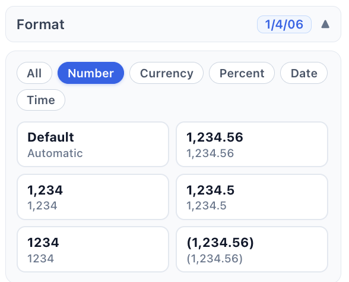
  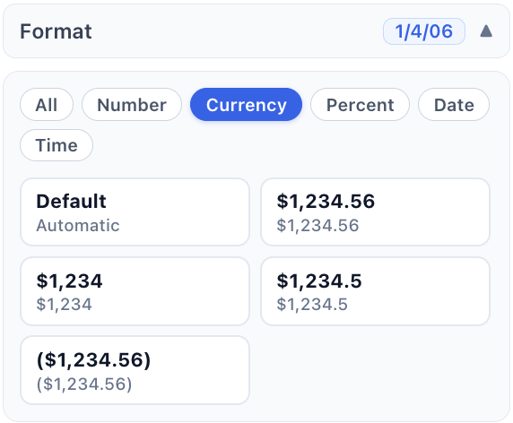
  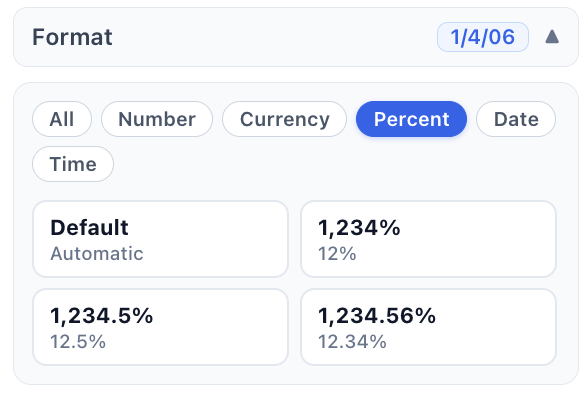
</p>
<p align="center">
  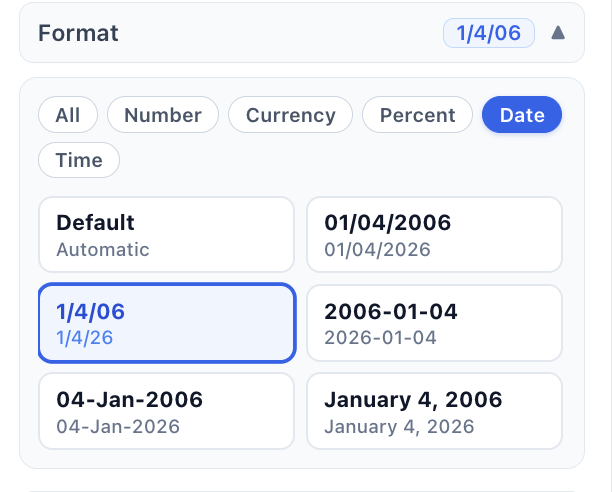
  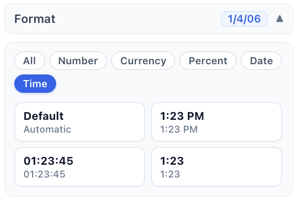
</p>

- **Numeric Formats**: Precision decimal control, integer display, comma thousand grouping (`#,##0.00`).
- **Currency Formats**: Localized currency symbols (`$`, `€`, `₹`), negative parentheses notation.
- **Percentage Formats**: Automatic conversion of decimals/fractions into clean percentage percentages (`15.00%`).
- **Date & Time Formats**: ISO timestamps, short date (`MM/DD/YYYY`), medium date (`DD-MMM-YYYY`), and 12/24-hour clocks.

### 12. Offline PDF Export Plugin (`socialcalc-ai/pdf-export`)
Generates PDFs of one sheet or the whole workbook on the device, with no server involved, so it works offline and inside Capacitor apps. Pages are split on row boundaries, chart canvases in the live editor are included, and every page gets a timestamp header, a footer label and `Page X of Y`.

The plugin is opt-in: it is not part of the main `socialcalc-ai` entry, so apps that do not import it do not need its dependencies. To use it, install the optional peer dependencies:

```bash
npm install jspdf html2canvas
```

```ts
import * as AppGeneral from "socialcalc-ai";
import {
  configurePdfExport,
  exportHTMLAsPDF,
  exportAllSheetsAsPDF,
  exportCurrentSheetAsPDF,
  exportWorkbookAsPDF,
  pdfBlobToBase64,
} from "socialcalc-ai/pdf-export";

// Optional app-wide defaults (per-call options still win)
configurePdfExport({ footerText: "Invoice", format: "a4", margin: 10 });

// Download the active sheet as invoice.pdf
await exportCurrentSheetAsPDF({ filename: "invoice", onProgress: console.log });

// Or pass HTML yourself and get a Blob back (e.g. to share with Capacitor)
const blob = await exportHTMLAsPDF(AppGeneral.getCurrentHTMLContent(), { returnBlob: true });
const base64 = await pdfBlobToBase64(blob); // ready for Filesystem.writeFile

// All sheets into one PDF, each sheet starting on a new page
await exportWorkbookAsPDF({ filename: "all_invoices" });
await exportAllSheetsAsPDF(AppGeneral.getAllSheetsData(), { returnBlob: true });
```

| Option | Default | Description |
|---|---|---|
| `filename` | `"document"` / `"all_sheets"` | File name without `.pdf` |
| `format` | `"a4"` | `"a4"`, `"letter"` or `"legal"` |
| `orientation` | `"portrait"` | `"portrait"` or `"landscape"` |
| `margin` | `10` | Page margin in mm |
| `quality` | `4` (one sheet) / `2` (all sheets) | html2canvas render scale |
| `headerText` | `null` | Top-left text; `null` prints the current date and time, `""` hides it |
| `footerText` | `""` | Bottom-left text on every page |
| `showPageNumbers` | `true` | Print `Page X of Y` bottom-right |
| `editorElementId` | `"tableeditor"` | Live editor element whose chart canvases are copied |
| `returnBlob` | `false` | Return a `Blob` instead of downloading the file |
| `onProgress` | — | Called with progress messages |

Importing the module registers it with the Plugin Manager as `"pdfExport"`, so `disablePlugin("pdfExport")` / `enablePlugin("pdfExport", defaults)` and `configurePlugin("pdfExport", defaults)` work too. Export calls reject while the plugin is disabled.

### 13. Share, Email & Print Plugin (`socialcalc-ai/share`)
Saves, shares, emails and prints exports the right way for the platform the app is running on, detected from the Capacitor runtime:

| | `saveFile` | `shareFile` | `sendEmail` / `emailCurrentSheet` | `printHTML` / `printCurrentSheet` |
|---|---|---|---|---|
| **iOS** | Cache file + share sheet | Share sheet | Share sheet with the attachment (PDF by default) | Native printer (AirPrint); PDF first, then HTML |
| **Android** | Cache file + share sheet | Share sheet | EmailComposer with the attachment (HTML by default) | Native printer (PrintService); PDF first, then HTML |
| **Web** | Download | Web Share API with the file, else download | Web Share with the file, else `mailto:` plus a download of the attachment | Hidden iframe + print dialog (no pop-up) |

The plugin does not import any Capacitor packages. On iOS and Android, pass in the ones your app has installed. On the web it needs nothing:

```bash
npm install @capacitor/filesystem @capacitor/share capacitor-email-composer @bcyesil/capacitor-plugin-printer
```

```ts
import { Filesystem, Directory, Encoding } from "@capacitor/filesystem";
import { Share } from "@capacitor/share";
import { EmailComposer } from "capacitor-email-composer";
import { Printer } from "@bcyesil/capacitor-plugin-printer";
import "socialcalc-ai/pdf-export"; // optional: lets email and print use PDFs
import {
  configureShare, getShareCapabilities,
  saveFile, shareFile, emailCurrentSheet, sendEmail, printCurrentSheet,
} from "socialcalc-ai/share";
import { exportCurrentSheetAsPDF } from "socialcalc-ai/pdf-export";

configureShare({ Filesystem, Directory, Encoding, Share, EmailComposer, Printer });

getShareCapabilities(); // { platform: "ios", emailMethod: "share-sheet", printMethod: "native-printer", ... }

// Export + deliver (download on the web, share sheet on devices)
const pdf = await exportCurrentSheetAsPDF({ returnBlob: true });
await saveFile({ blob: pdf, filename: "invoice.pdf", dialogTitle: "Share PDF" });

// Email the active sheet (attachment format chosen per platform, or set attachmentFormat)
await emailCurrentSheet({ filename: "INV-001", subject: "Your invoice", body: "Please find it attached." });

// Or any email / attachment
await sendEmail({ to: ["a@b.com"], subject: "Data", attachment: { text: csv, filename: "data.csv", mimeType: "text/csv" } });

// Print the active sheet
await printCurrentSheet({ name: "INV-001", orientation: "portrait" });
```

Every call resolves to `{ method, platform }` (e.g. `{ method: "email-composer", platform: "android" }`), so the app can show the right message. Temporary cache files are deleted 60 s after sharing (`configureShare({ cleanupAfterMs })`). The plugin registers as `"share"` with the Plugin Manager, and calls reject while it is disabled.

---

## 📡 Event-Driven Architecture

`socialcalc-ai` broadcasts standard DOM CustomEvents on the `window` object. This allows any framework (React, Vue, Svelte, Angular, Vanilla JS) to react to spreadsheet changes:

| Event Name | `event.detail` Structure | Purpose |
| :--- | :--- | :--- |
| `socialcalc:cell-edit-request` | `{ coord: string, text: string, okfn: Function, cleanup: Function }` | Fired when a cell is clicked/tapped. Consumed by `CellEditModal`. |
| `socialcalc:row-header-click` | `{ rowNum: number, originalEvent: MouseEvent }` | Fired when a row number index is clicked. Consumed by `RowActionPopover`. |
| `socialcalc:cell-change` | `{ coord: string, value: string }` | Fired after a cell's value or formula is committed and recalculated. |
| `socialcalc:horizontal-scroll`| `{ currentFirstCol: number, currentColName: string, totalCols: number }` | Fired whenever the horizontal viewport column changes. |
| `socialcalc:plugin-change` | `{ pluginName: string, state: boolean, allStates: Record<string, boolean> }` | Fired whenever a plugin is registered, enabled, or disabled. |
| `socialcalc:agent-action` | `{ actions: Array, commands: string[], results: Array, timestamp: number }` | Fired whenever the AI Agent executes actions on the spreadsheet. |

### Event Listener Example:

```ts
window.addEventListener("socialcalc:cell-change", (e: CustomEvent) => {
  const { coord, value } = e.detail;
  console.log(`Cell ${coord} changed to: ${value}`);
});
```

---

## 🤖 AI & MultiSheet Calc (MSC) Integration

`socialcalc-ai` is built for automated and LLM-driven spreadsheet workflows:

### Generating Spreadsheets via LLMs
AI agents can generate spreadsheet structures in SocialCalc MSC format (MultiSheet Calc). An MSC document defines multiple named sheets with cell formulas, formats, and values:

```json
{
  "sheets": {
    "Summary": {
      "content": "cell:A1:t:Quarterly Revenue\ncell:A3:t:Q1\ncell:B3:v:12500\ncell:A4:t:Q2\ncell:B4:v:14200\ncell:A5:t:Total\ncell:B5:v#:=SUM(B3:B4)"
    }
  }
}
```

Load this directly into `socialcalc-ai`:

```ts
import * as AppGeneral from "socialcalc-ai";

AppGeneral.loadWorkbookData(aiGeneratedMscJson);
```

---

## 🛡 TypeScript Support

`socialcalc-ai` ships with full type definitions in `index.d.ts`:

```ts
import * as AppGeneral from "socialcalc-ai";
import {
  CellEditModal,
  CellEditModalProps,
  HorizontalScrollBarProps,
  RowActionPopoverProps
} from "socialcalc-ai";
```

---

## 💻 Browser & Framework Compatibility

- **Browsers**: Chrome, Edge, Safari, Firefox (Desktop & Mobile).
- **Frameworks**: React 18+, Ionic React 7+, Next.js (Client Component), Vite, Plain JavaScript.
- **Runtimes**: Node.js 18+ (for headless calculation & CSV/MSC transformation).

---

## 📦 Release Notes

### v1.0.8
- **Share, Email & Print Plugin**: New opt-in `socialcalc-ai/share` entry for platform-aware (iOS / Android / web) file saving and sharing, email with attachments, and printing. Capacitor plugins are passed in with `configureShare()`.
- **CSV & MSC exporters**: `exportCurrentSheetAsCSV`, `exportCSV`, `cleanCSV`, `convertToCSV`, `exportMSC`, `parseMSCFile`, `downloadBlob` and `blobToBase64` in the main entry.
- **Plugin Manager**: `getPlugin(name)` returns a registered plugin, including the `api` it exposes.

### v1.0.7
- **Offline PDF Export Plugin**: New opt-in `socialcalc-ai/pdf-export` entry that exports the active sheet or the whole workbook to PDF on the device (jsPDF + html2canvas as optional peer dependencies), registered as the `pdfExport` plugin.

### v1.0.3
- **Node.js ESM & Runtime Compatibility**: Enhanced UMD root resolution across all core modules to support `globalThis`, eliminating undefined root errors in Node.js ES module loaders.
- **TypeScript Declarations**: Bundled official type declarations (`index.d.ts`) covering all core exports, plugin modules, and React/Ionic UI modal components.
- **Packaging Refinements**: Added `.npmignore` to exclude test files, scratch scripts, and developer metadata from distributed tarballs.

### v1.0.2
- **Cell Edit Modal Fix**: Fixed cell click interceptor and mouse delegates so clicking any cell reliably triggers the `CellEditModal` bottom sheet.
- **Scroll Distortion Fix**: Resolved table border collapse and column misalignment when scrolling past multi-row (`rowspan`) and multi-column (`colspan`) blocks.
- **Formula Support**: Enhanced modal editing to support formula values (`=SUM(...)`) seamlessly alongside raw numbers, text, and HTML formatting.
- **Strict Column Sizing**: Enforced CSS pixel widths and `box-sizing: border-box` containment across `<colgroup>` and sizing rows to preserve layout integrity.
- **Safety Guards**: Added null guards and try/catch protection across SocialCalc workbook control callbacks.

---

## 📜 License & Acknowledgments

- **Original SocialCalc Engine**: Created by Dan Bricklin (co-creator of VisiCalc) and Socialtext.
- **Modernized `socialcalc-ai` Package**: Maintained and modernized for ES6 modules, React/Ionic UI components, touch physics, and AI workflows by **Anirudh Sharma** under the **MIT License**.

Feel free to open issues and pull requests to help enhance the modern spreadsheet engine!
